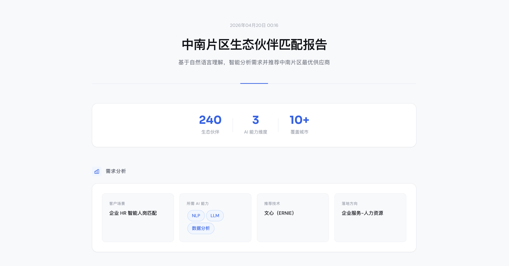
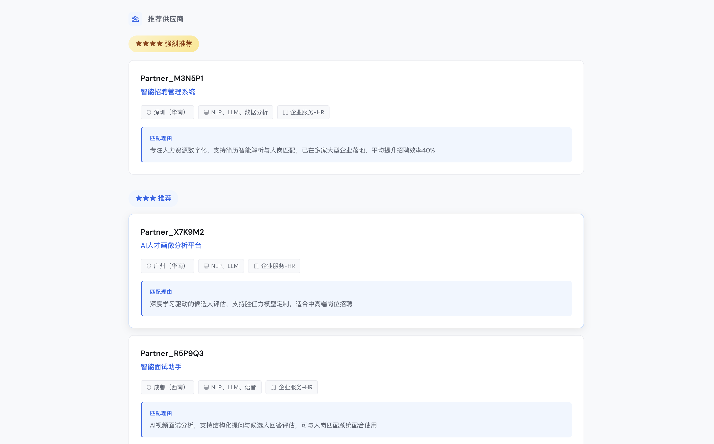
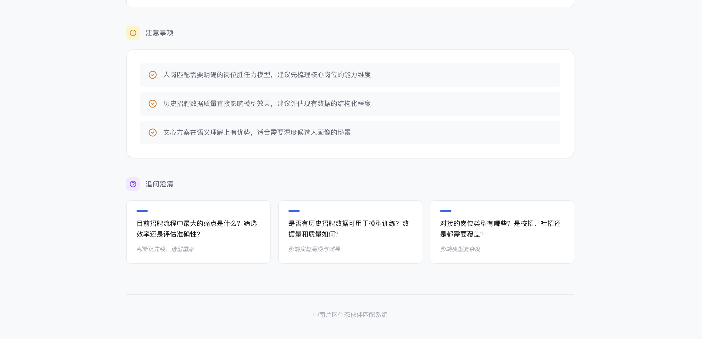

# ecopartner-recommend

> 将模糊的 AI 需求，精准匹配至合适的生态伙伴

---

## 产品简介

**ecopartner-recommend** 是一款面向区域生态运营的智能匹配工具，帮助运营人员快速将客户的 AI 需求与生态伙伴进行精准对接。

在实际工作中，运营人员常常会收到来自客户的各类 AI 落地需求。凭借记忆难以快速从数百家生态伙伴中找到真正具备相关能力和案例的合作伙伴。**ecopartner-recommend** 通过结构化的能力分析与智能匹配，让需求对接更加高效、专业。

---

## 核心能力

### 智能需求解析

输入客户需求后，工具会自动拆解背后所需的 AI 能力组合（OCR 文字识别、CV 视觉检测、NLP 自然语言处理、LLM 大模型、语音识别、时序分析等），并推荐适合的技术路线（PaddlePaddle 或 ERNIE）。

### 精准伙伴匹配

基于生态伙伴的 AI 能力标签与实际落地案例，按照匹配度进行分级推荐：
- **强烈推荐**：AI 能力与行业场景双重匹配
- **推荐**：能力或场景部分匹配
- **备选**：仅能力匹配

### 专业追问建议

根据不同场景智能生成关键追问，帮助运营人员深入了解客户实际情况，包括项目阶段、数据基础、预算周期等核心信息。

### 可视化报告生成

完成匹配后，自动生成一份完整的 HTML 报告，包含：
- **需求分析**：客户场景、所需 AI 能力组合、推荐技术路线
- **伙伴推荐**：按匹配度分级的推荐列表，含企业名称、产品亮点、典型客户、定价参考
- **匹配理由**：每家推荐伙伴的核心优势说明
- **注意事项**：选型和实施过程中的关键提示
- **追问清单**：引导深入了解项目的关键问题

报告支持在浏览器中直接打开，可快速分享给团队或客户，提升沟通效率。

---

## 工作逻辑

```
┌─────────────────────────────────────────────────────────────┐
│                        需求输入                              │
│  「企业 HR 想通过 AI 实现智能人岗匹配」                        │
└─────────────────────────┬───────────────────────────────────┘
                          ▼
┌─────────────────────────────────────────────────────────────┐
│  Step 1：智能需求解析                                        │
│  ├── 问题识别：智能人岗匹配与简历筛选                         │
│  ├── 能力拆解：NLP（简历解析）+ LLM（语义匹配）+ 数据分析       │
│  └── 技术选型：文心（语义理解与对话生成优势）                  │
└─────────────────────────┬───────────────────────────────────┘
                          ▼
┌─────────────────────────────────────────────────────────────┐
│  Step 2：多标签组合匹配                                      │
│  ├── 优先：ai_tags 同时包含 NLP + LLM + 数据分析               │
│  ├── 其次：ai_tags 包含 NLP/LLM + 企业服务/HR行业              │
│  └── 备选：仅 ai_tags 包含核心能力                           │
└─────────────────────────┬───────────────────────────────────┘
                          ▼
┌─────────────────────────────────────────────────────────────┐
│  Step 3：分级推荐输出                                        │
│  ├── ⭐⭐⭐⭐ 强烈推荐：能力+场景双匹配的伙伴                  │
│  ├── ⭐⭐⭐ 推荐：能力或场景部分匹配的伙伴                    │
│  └── ⭐⭐ 备选：仅能力匹配的伙伴                             │
└─────────────────────────┬───────────────────────────────────┘
                          ▼
┌─────────────────────────────────────────────────────────────┐
│  Step 4：智能追问                                           │
│  └── 生成 1-3 个关键问题，引导深入了解项目情况                │
└─────────────────────────┬───────────────────────────────────┘
                          ▼
┌─────────────────────────────────────────────────────────────┐
│  Step 5：HTML 可视化报告                                    │
│  └── 自动生成完整匹配报告，支持浏览器打开与分享              │
└─────────────────────────────────────────────────────────────┘
```

---


## 效果展示




---

## 覆盖范围

| 维度 | 详情 |
|------|------|
| 生态伙伴 | 240+ 家 |
| 覆盖区域 | 华南（广东、广西、海南、福建）、华中（湖南、湖北）、西南（重庆、四川） |
| 技术路线 | 飞桨 PaddlePaddle、文心 ERNIE |
| AI 能力 | OCR、CV、NLP、LLM、语音、时序预测 |

---

## 数据说明

本仓库中的 `references/partner-data.json` 已进行脱敏处理，企业名称以 `Partner_XXXXXX` 格式呈现。

⚠️ **如需使用完整数据进行精确匹配，请按以下步骤操作获取未脱敏的完整原始数据：**


1. 联系 `yewenyi` 获取未脱敏的 `partner-data.json` 完整文件
2. 将获取的文件替换至 `references/partner-data.json`
3. 重启匹配工具，即可显示真实企业名称

替换后，报告中的 `Partner_XXXXXX` 将显示为实际企业名称。

---

## 仓库结构

```
ecopartner-recommend/
├── SKILL.md                     # 匹配逻辑定义文件
├── README.md                    # 项目说明文档
├── .gitignore
└── references/
    ├── partner-data.json        # 脱敏版伙伴数据（240+条）
    ├── partner-data-schema.md   # 数据字段说明文档
    ├── report-template.html     # HTML 报告模板
    └── match-report-example.html # 报告示例
```

---

## 维护信息

- 版本：3.0
- 维护人：yewenyi
- 更新日期：2026-04-20
