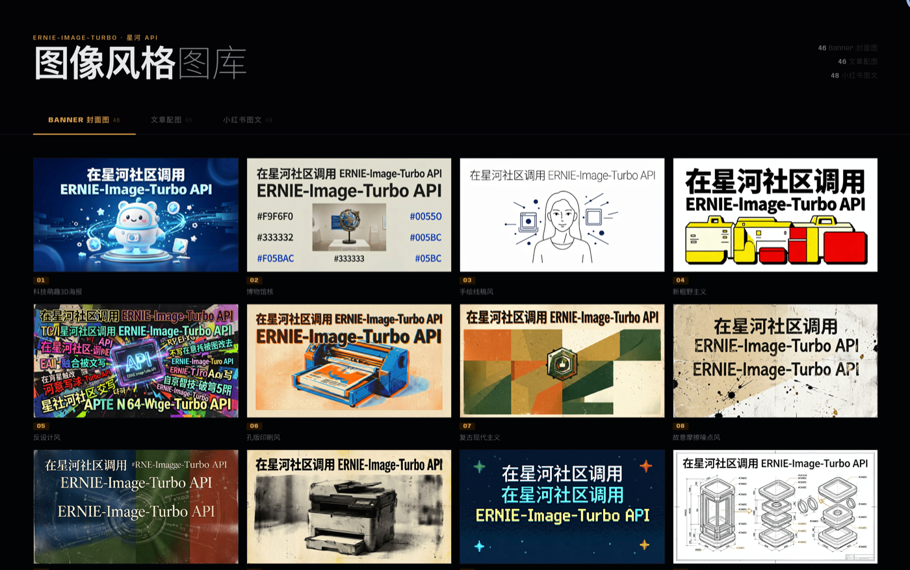
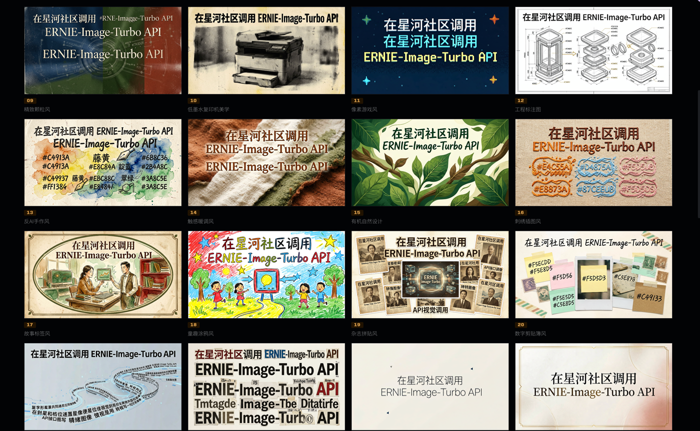
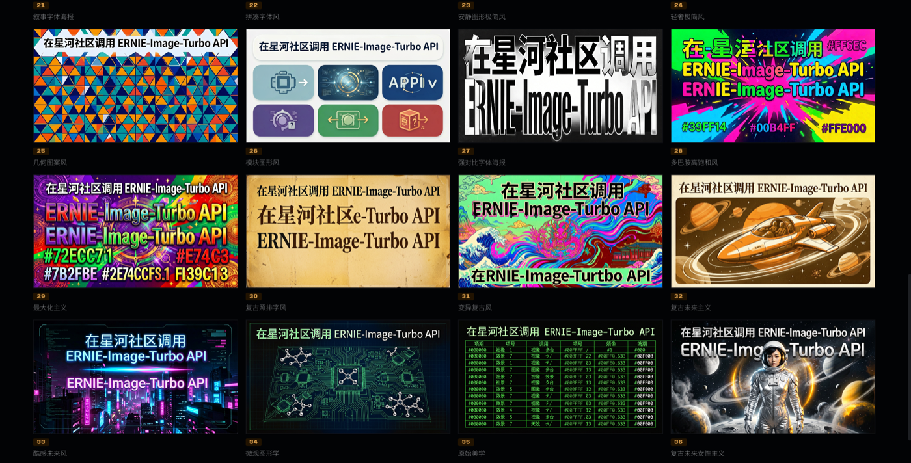
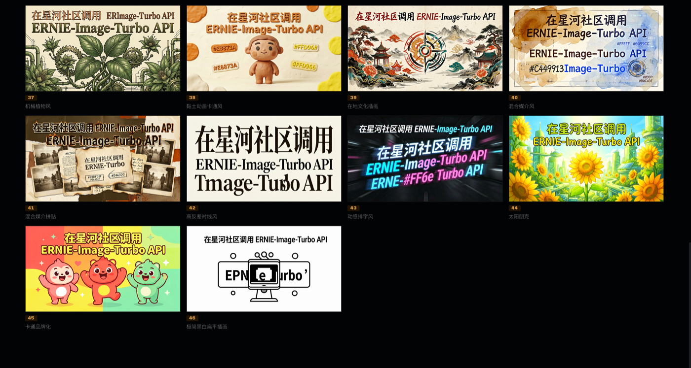
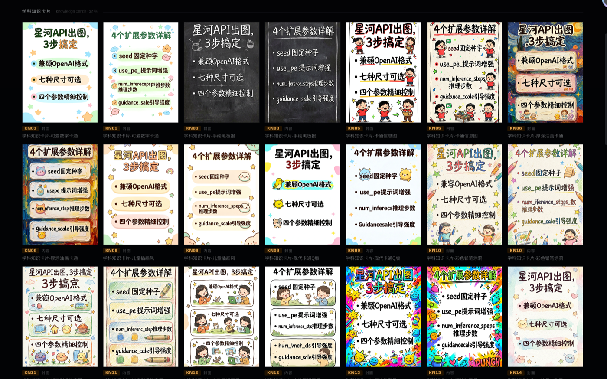
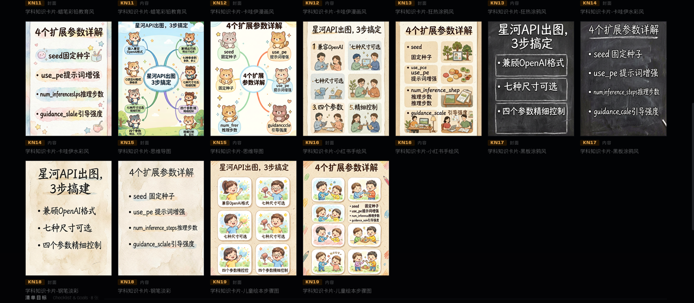
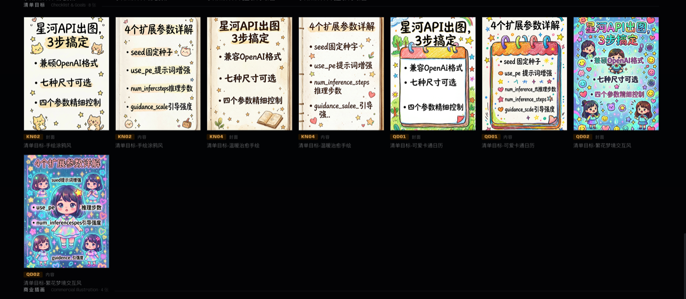
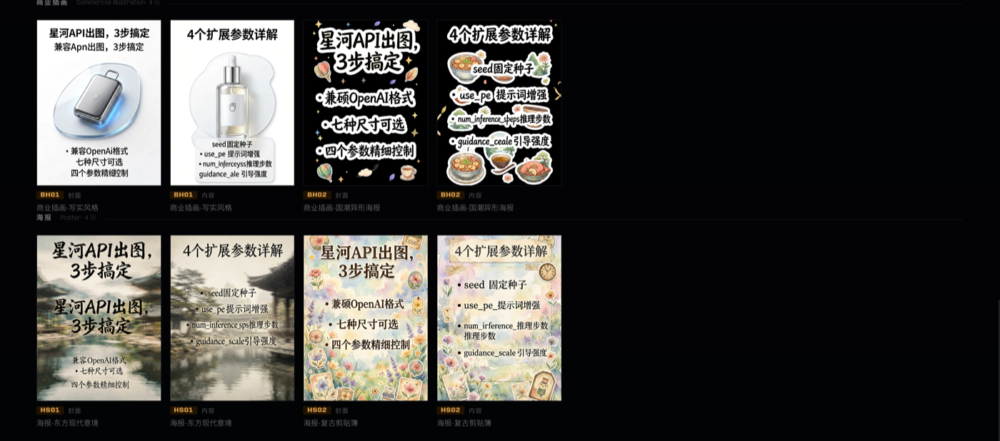

# xinghe-image

**星河 AI 生图 Skill** — 基于平面海报设计风格体系，AI 自动推荐风格，一站式生成 banner、文章配图、封面图、小红书图文。

---

## 功能

| 场景 | 说明 | 默认尺寸 |
|------|------|---------|
| 📰 Banner / 封面图 | 文章顶部封面，视觉海报或信息图式两种模式 | `1376x768`（16:9） |
| 🖼️ 文章配图 | 为文章每个章节生成海报级配图，支持表达性/说明性 | `1264x848`（3:2） |
| 📊 信息图 | 数据可视化、知识图谱、流程图海报 | `1264x848`（3:2） |
| 📱 小红书图文 | 多图卡片 + 发帖文案包，小红书平台优化 | `848x1264`（3:4） |

- **预设路线**：30 条完整图文提示词预设（信息图/小红书直接可用）
- **组装路线**：46 种平面海报设计风格（封面/文章配图，AI 推荐 3 个方向）
- 直接调用星河 API，配置一次 API Key 即可使用

---

## 效果预览

### Banner / 封面图 · 文章配图（组装路线，46 种风格）






### 小红书图文（预设路线，30 条预设）






---

## 前置要求

| 依赖 | 版本要求 | 说明 |
|------|---------|------|
| Node.js | 任意 | `npx` 安装 skill 时需要，装 Node.js 即自带 |
| Python | 3.8+ | `python3 --version` 检查 |
| openai | 任意 | `pip install openai` |
| 网络 | 国内可达 | 访问 aistudio.baidu.com（百度国内服务，无需外网） |
| API Key | — | 百度 AIStudio Access Token（免费，见下方） |

### 获取 API Key

1. 打开 [https://aistudio.baidu.com/account/accessToken](https://aistudio.baidu.com/account/accessToken)
2. 登录百度账号，复制页面上的 **Access Token**

### 配置 API Key

**无需手动配置。** 首次启动 skill 时，AI 会自动检测是否已配置 API Key。若未配置，AI 会引导你粘贴 Key，并自动完成写入和验证，全程无需手动执行任何命令。

---

## 安装方式

### 一键安装（推荐）

```bash
# 全局安装（所有项目可用）
npx skills add AgenticAIPlan/AgenticAISkills --skill xinghe-image -g

# 项目内安装（仅当前项目可用）
npx skills add AgenticAIPlan/AgenticAISkills --skill xinghe-image
```

> 需要 Node.js 环境。`npx skills` 会自动检测你已安装的 Agent 工具（Claude Code、Cursor、Codex 等），选择后即可完成安装。

---

## 使用方式

安装后，在 AI IDE 工具中直接对话触发：

```
/xinghe-image
```

或使用触发词：

```
生图 / 配图 / 封面 / 信息图 / 小红书图片 / 小红书图文 / 小红书帖子
```

**示例对话：**

```
为 article.md 生成 banner + 文章配图
```

```
帮我生成一张 GELU激活函数 的文章封面
```

```
给这篇文章做一套小红书图文，包括封面和 4 张内容图
```

---

## 生图后如何查看图片

生成的图片以**相对路径**插入 Markdown，例如：

```markdown

```

### VSCode 预览

VSCode 默认 Markdown 预览文件大小限制为 2MB，含配图的文章可能超限。
在 `settings.json` 中添加：

```json
"markdown.preview.maxFileSize": 52428800
```

然后 `Cmd+Shift+V` 重新打开预览即可。

> **不推荐**将图片转为 base64 内嵌——文件会膨胀至 10MB 以上，大多数编辑器渲染缓慢或直接失败。

### Typora

直接用 Typora 打开 `.md` 文件，支持相对路径图片，无需任何配置。

---

## 文件结构

```
xinghe-image/
├── SKILL.md                          # 主定义文件（AI 执行入口）
├── README.md                         # 本文件
├── assets/                             # README 效果预览图
├── scripts/
│   └── generate.py                   # 星河 API 生图脚本
└── references/
    ├── styles-index.csv              # 组装路线风格库（46 种平面海报设计风格）
    ├── image-presets.csv             # 预设路线风格库（30 条完整提示词预设）
    └── workflows/                    # 各场景子流程
        ├── prompt-assembly.md        # 风格推荐规则 + 提示词组装规则（必读）
        ├── cover-image.md            # 封面图 / Banner 流程
        ├── article-illustration.md   # 文章配图流程
        ├── infographic.md            # 信息图流程
        └── xiaohongshu.md            # 小红书图文流程
```

---

## API 说明

```
端点：https://aistudio.baidu.com/llm/lmapi/v3
鉴权：Bearer Token（通过 AISTUDIO_API_KEY 环境变量传入）
```

| 模型 | 说明 | 推理步数 | 速度 |
|------|------|---------|------|
| 星河图像生成模型 | 百度 AIStudio 图像大模型 | 8步（默认）/ 50步（高质量） | 8步约 3-5s |

**脚本参数说明**：

| 参数 | 必填 | 默认值 | 说明 |
|------|------|--------|------|
| `--prompt` / `-p` | ✅ | — | 生图提示词，推荐中文 |
| `--size` / `-s` | ✅ | `1024x1024` | 图片尺寸，必须是下方 7 个合法值之一 |
| `--output` / `-o` | ✅ | — | 输出文件路径，`.png` 格式 |
| `--n` | — | `1` | 一次生成张数，可选 1-4 |
| `--steps` | — | `8` | 推理步数：`8`=Turbo 快速，`50`=标准高质量 |
| `--guidance` | — | `1.0` | 引导强度 guidance_scale |
| `--no-pe` | — | 关闭 | 禁用提示词增强（默认开启 PE） |
| `--seed` | — | `-1` | 随机种子，`-1` 为随机 |

支持尺寸：`1024x1024` / `848x1264` / `768x1376` / `896x1200` / `1264x848` / `1376x768` / `1200x896`

---

## 常见问题排查

| 错误信息 | 原因 | 解决方式 |
|---------|------|---------|
| `错误: 未找到 API Key` | `AISTUDIO_API_KEY` 未设置 | 参考上方「配置 API Key」 |
| `401 Unauthorized` | Key 无效或已过期 | 重新获取：[accessToken](https://aistudio.baidu.com/account/accessToken) |
| `400 Bad Request` | 尺寸不合法 | 只能用 7 个合法尺寸，见 API 说明 |
| `ImportError: openai` | 依赖未安装 | `pip install openai` |
| 图片生成但中文乱码 | 提示词未加中文渲染约束 | 确认提示词末尾包含中文渲染约束行 |
| 系列图风格不一致 | 后续图未复用第一张的风格描述 | 参考 SKILL.md「视觉一致性」节 |

---

**贡献者 / Contributors:** [@zhangxiang](https://github.com/zhangxiang) · [@yangjianwen](https://github.com/yangjianwen) · [@liuyunlin](https://github.com/liuyunlin)
